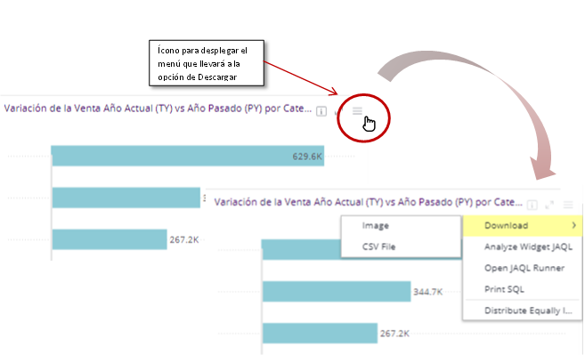
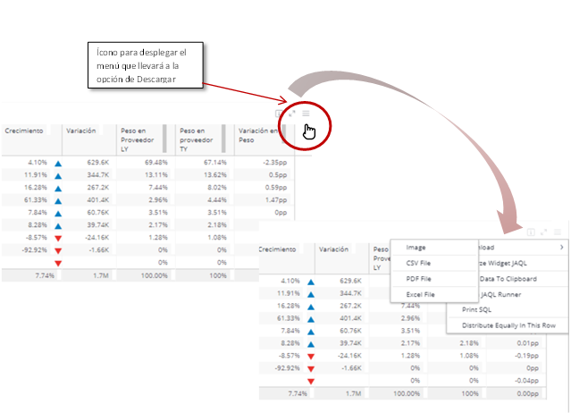
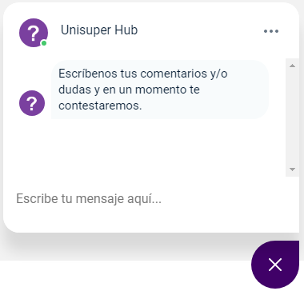
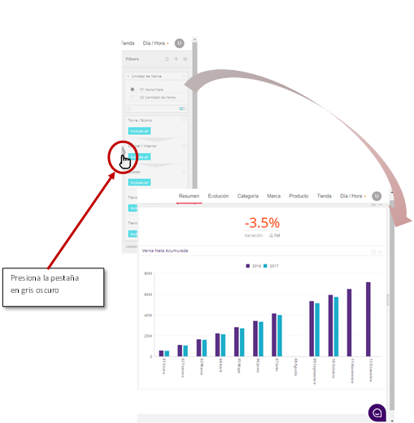
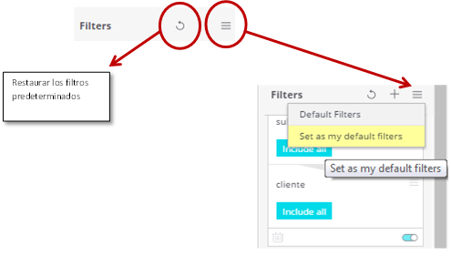
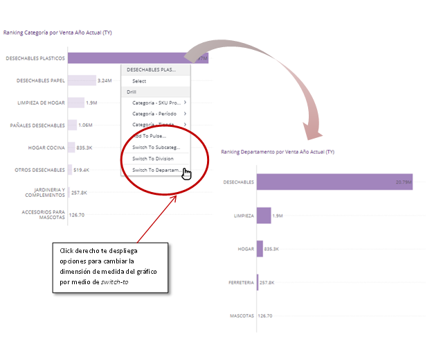
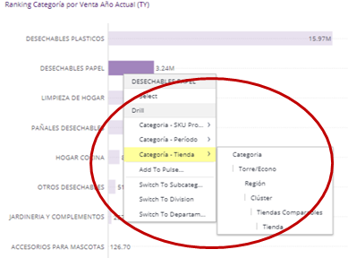
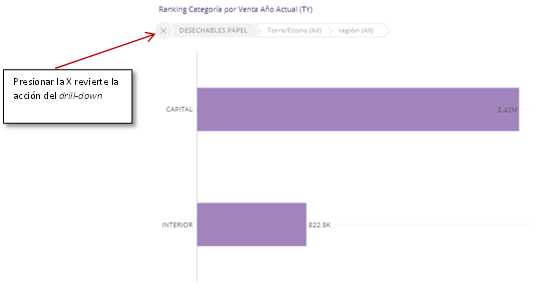

# Soluciones a Preguntas Frecuentes

Algunas soluciones aquí mostradas

Outline 

* [Descarga de información](#dwnld_info)
* [Soporte vía chat](#soprt_chat)
* [Filtros](#filter)
* [Alternar entre dimensiones de medida (Switch-to)](#switch_to)
* [Desglose de información](#drill_down)

## Descarga de información 

A veces deseas hacer un análisis específico utilizando la informaciónque estas visualizando, o utilizar las imágenes de gráficos o de las tablas. Afortunadamente existe la opción de descargar la información de los elementos en distintas modalidades,ya sea como imagen (formato png), o archivo en formato csv, pdf, o xlsx segúnel tipo  de *widget*.

Para esto puede posicionarse en la esquina superior derecha, donde aparecerá el ícono. Para esto puede posicionarse en laesquina superior derecha, donde aparecerá el ícono . Al presionar, con el botón izquierdo, tendrás las distintas opcionespara descargar. En caso el widget seade algún gráfico, podrás descargarla como imagen o los valores fuentesnecesarios para generarla, en formato csv.

En caso sea una tabla, podrás descargarla como imagen, ya sea en formato pdf, csv, o incluso en Excel (xlsx).

  

[volver al outline](#outline)

***

## Soporte vía Chat 

Al ingresar a la Plataforma tendrás disponible el soporte en tiempo realpor medio de una ventana de chat. Para acceder a ella, ubica el ícono en laesquina inferior derecha de tu pantalla, y presiónalo.

Al presionar el botón, se extenderá una ventana donde podrás comunicartecon uno de nuestros especialistas que te ayudarán en lo que necesites.

 

Nota: El horario de atención está sujeto al horariolaboral, de 08:00 a 18:00, entre semana y susceptible a asuetos locales. En caso norecibas respuesta, uno de nuestros encargados se comunicará contigo vía correo o chat.

[volver al outline](#outline)

***

## Filtros 

### Ocultar y mostrar filtros generales

Para una mejor visualización en tu pantalla o durante una presentación, tienes la opción de esconder los filtros generales mientras no necesites hacerle cambios. Para esto, ubica la pestaña en gris oscuro como se ve en la figura. Los filtros generales tomarán un color ligeramente más oscuro, y la pestaña se hará más visible. Presiónala y los filtros se ocultarán. Para revertir el efecto, presiona en la misma pestaña.

### Filtros Default

Actualmente los filtros tienen una configuración predeterminada, pero como usuario puedes personalizarla. Esto puede realizarse
cambiando los *default filters* que, una vez los haya modificado los filtros generales a tu gusto, puedes establecerlos como predeterminados en la parte superior como se ve en la imagen. Esto te permitirá hacer cambios en los filtros, y restaurarlos a tu configuración favorita presionando el botón circular de restauración. Toma nota que los *dashboards* mantendrán la configuración tal como la hayas dejado en la última vez de utilización.

[volver al outline](#outline)

***

## Alternar entre dimensiones de medida (Switch-to) 

En algunas gráficas existe la opción de alternar entre dimensiones de medida. Por ejemplo, el siguiente gráfico de Ranking de Categorías según la venta puede mostrarse por medio de Departamento en lugar de Categorías. Esto es posible haciendo click derecho donde tendrás distintas opciones de dimensiones de medida. 

Nota: Esta opción está disponible para gráficos seleccionados.

[volver al outline](#outline)

***

## Desglose de información (Drill-down) 

El desglose, o drill-down, permite la exploración dinámica de información. Esta característica puede utilizarse en tablas y gráficas donde se haya definido de fábrica. Puedes hacer esto haciendo *click* derecho sobre la categoría de interés y escoger el tipo y nivel de desglose en Drill (donde esté disponible)

En el ejemplo, se escoge el desglose a nivel de Región obteniendo

[volver al outline](#outline)

***

